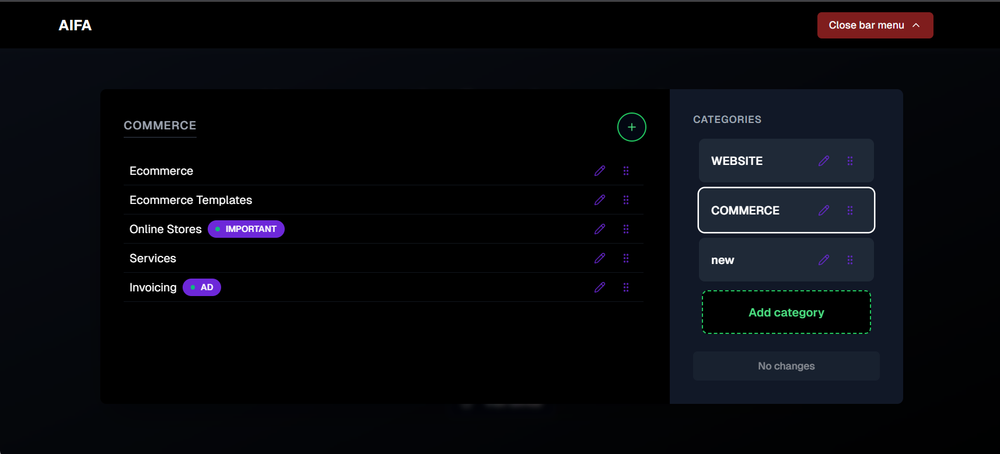
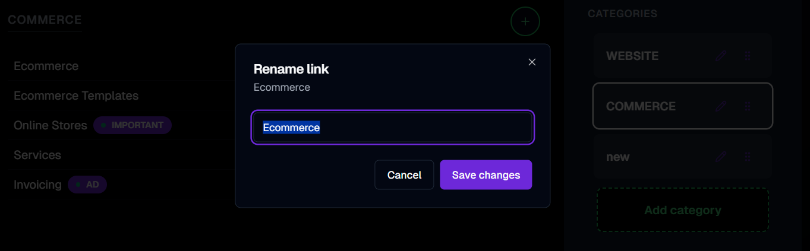
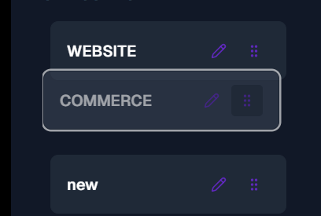
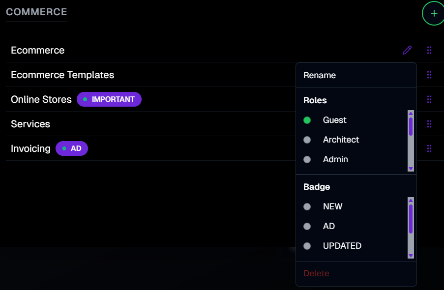

  

<h1 align="center">AIFA Editable Navigation Menu</h1>

  
  
  

> An advanced, fully editable, and open-source navigation menu for React/Next.js. Now you can manage categories and links, reorder, rename, control badges and roles—all directly in the navigation bar UI, without any separate admin panel.

  

## 🚀 About The Project

**AIFA Editable Navigation Menu** is the next-generation solution evolving from our earlier static navigation starter. This is not just a static navigation bar—it's a dynamic, interactive system with built-in admin mode. Any permitted user can add, rename, remove, or reorder categories and links, and manage roles and badges, all in one unified, visual menu interface.

**Main difference:**  
No more side panels, tabs, outdated admin pages or complicated settings—everything happens contextually within the menu. Editing is fast, natural, and visible live to all users.

We recommend checking out the [original static starter](https://github.com/aifa-agi/aifa-navigation-menu) first, to grasp the improvement and flexibility offered by this advanced version.

---

  <strong>One-Window Editable Interface (Desktop)</strong> 
  

  <strong>Edit Actions and Modals</strong> 
  

  <strong>Drag & Drop: Fast Sorting for Any Level</strong> 
  

  <strong>Editable Drop-down Panel</strong> 
  

---

## ✨ Core Features

- **🖊️ Quick inline editing:** Change names, order, and properties for categories or links instantly right from the nav menu.
- **➕ Add and remove links/categories:** Insert or remove items directly, all updates instantly visible.
- **🎛️ Role control and badges:** Any link or category can be restricted by role (guest, admin, subscriber, etc.), with visual badges for attention.
- **🟢 Live Drag-and-Drop:** Intuitive drag-and-drop for both categories and links, with real-time UI feedback.
- **⏳ Unsaved changes ("Dirty" state):** Clear indication when you have changes and one-click push to server (demo, serverless-ready).
- **📱 Responsive:** Full mobile/desktop support; one codebase, one menu.
- **🧑‍💻 No separate admin:** All management in-context, WYSIWYG.
- **⚡ Seamless state sync:** Every update is instantly reflected in both admin and public navigation—no reload needed.

---

## 📚 Upgrade Over Previous Static Menu

Whereas the original [static-menu starter](https://github.com/aifa-agi/aifa-navigation-menu) provided a stable, config-driven navigation for classic sites (blogs, portfolios), the **editable menu** gives you a real, fluid admin-like experience. It's ideal for SaaS, evolving apps, and anyone looking for modern navigation UX with zero switching between panels.

- **Original:** Edit in config, deploy to see changes, static.
- **Now:** Edit live, see changes instantly, modern admin philosophy.

**Study this starter after the non-editable menu for best learning experience!**

---

## 🏁 Getting Started

_To get a local copy up and running, follow these simple steps..._

---

## 🛠️ Technology Stack

| Category          | Technologies                                                                                                                    |
| :---------------- | :----------------------------------------------------------------------------------------------------------------------------- |
| **Framework**     | [Next.js](https://nextjs.org/) 15, [React](https://react.dev/) 19                                                              |
| **UI & UX**       | [shadcn/ui](https://ui.shadcn.com/), [Tailwind CSS](https://tailwindcss.com/), [Framer Motion](https://www.framer.com/motion/), [Lucide Icons](https://lucide.dev/) |
| **Code & Typing** | [TypeScript](https://www.typescriptlang.org/), [Zod](https://zod.dev/)                                                         |

---

## ℹ️ Roadmap

In the next starter we will introduce AI-powered page creation: you'll be able to create content/pages right from the navigation menu using artificial intelligence, moving towards a fully visual, fully flexible CMS experience. Stay tuned!

---

## 📄 License

This project is distributed under the AGPL-3.0 license to ensure the openness of all derivative works.

---

## 🏋️‍♀️ Author

Roma Armstrong  
telegram: **@roma_armstrong**

---

_The future is not written in corporate data centers, but in code that lives and evolves on millions of servers around the world._
